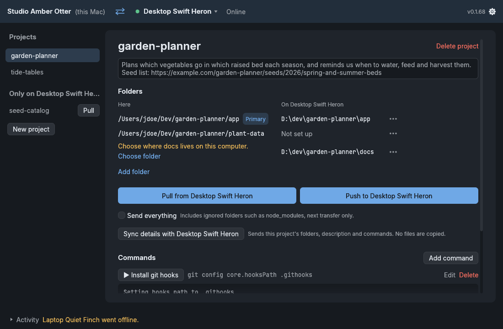

# Project Transfer

Project Transfer is a desktop app for macOS and Windows that copies project
folders between your computers on the same local network. Open it on two
computers, pair them once, and from then on push or pull a project with one
button. The app finds the other computer by itself, talks to it over its own
encrypted connection, and shows you every change before it writes anything.



## Install

You need Rust (stable) to build it. From the repository, run the helper for
your system:

| System  | Command                         |
| ------- | ------------------------------- |
| macOS   | `./install`                     |
| Windows | `.\install.ps1` (in PowerShell) |

Both run `cargo xtask install`, which you can also run yourself. If Windows
says running scripts is disabled, run
`powershell -ExecutionPolicy Bypass -File .\install.ps1` instead.

The installer builds a release binary and installs it:

| System  | What it does                                                                                                                                                                                                                            |
|---------|-----------------------------------------------------------------------------------------------------------------------------------------------------------------------------------------------------------------------------------------|
| macOS   | Builds `Project Transfer.app`, signs it ad hoc and installs it in `/Applications`, or in `~/Applications` when `/Applications` is not writable. A running copy is quit first. The old copy is kept aside until the new one is in place. |
| Windows | Copies `Project Transfer.exe` to `%LOCALAPPDATA%\Programs\Project Transfer` and adds a Start menu shortcut. A running copy is closed first.                                                                                             |

To install somewhere else, pass a folder:

```
./install --dest ~/Desktop/test-install
```

The installed app does not need the source checkout. Settings and paired
computers are kept when you reinstall.

## Where folders go on the other computer

Each computer keeps its own path for every folder of a project. The folders
table shows both: **Here** and **On <other computer>**, with `~` standing
for the home folder there.

A folder the other computer doesn't have a path for yet gets one there by
default:

- A folder inside your home folder but outside the Projects folder, such
  as `~/.microsoft/usersecrets/<id>`, goes to the same place under the home
  folder there. Tools look for such folders in one fixed place.
- Any other folder goes into the Projects folder there: `<Projects>/<folder>`
  for a project with one folder, `<Projects>/<project>/<folder>` for one
  with several.

If that place is already part of another project there, the folder goes
to the Projects folder instead, so no folder ever mirrors over another
project's files.

**Sync details with <other computer>**, under the Push and Pull buttons,
sends the project's folders, description and commands without copying any
files, and brings back what the other computer has that this one lacks. A
new folder then shows its place in the **On <other computer>** column
before anything is pushed. Syncing needs the other computer to allow pushes
from this one.

To put a folder somewhere else on the other computer, open the folder's
**…** menu and choose **Change folder on <other computer>…**. Enter a full
path there, or one starting with `~` for its home folder. The other
computer refuses its home folder, the top of a disk, and a place that
overlaps a folder of another project. Nothing moves when you save: the next
push copies the files to the new place.

## Ignore list

Some folders are regenerated by tools and are not worth copying. By default
the app skips `node_modules`, `bin`, `obj`, `packages`, `dist`, `.build`,
`target`, `.vs`, `.idea`, `__pycache__`, `.pytest_cache`, `.gradle`, `.next`,
`.nuxt`, `.cache`, `.DS_Store` and `Thumbs.db`.

In Settings you can add and remove patterns (gitignore style) and add
**always include** patterns, which win over every ignore pattern. The list of
the computer that starts a transfer applies to both sides, and changes apply
to the next transfer.

## Local network only

The app only talks to computers on your local network. Discovery uses mDNS,
which cannot leave the network, and the app refuses any address that is not a
private one (such as `192.168.x.x`, `10.x.x.x` or `172.16.x.x` to
`172.31.x.x`). Connections are encrypted with TLS. The app listens on TCP
port 47820, or on another free port if that one is taken; if a firewall asks,
allow it on private networks.

If your network blocks discovery, use **Add by address** with the address
shown in the other computer's Settings.
